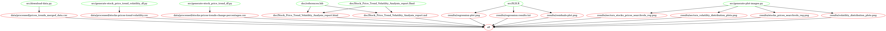
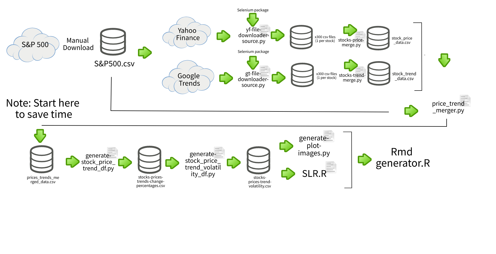

# Stock-Price-Trend-Volatility-Analysis

## Project Overview

Investment firms are increasingly looking to data science and unusual data sources to provide informational advantages to bolster their portfolio strategies. In this project, we are investigating whether Google Trends data on stock ticker names can provide insight into return volatility\*\*. Investors are often interested in understanding the volatility of stock returns. Some financial derivative trading strategies try to take advantage of changes in a stocks' volatility, as certain options are sensitive to changes in implied volatility. See a primer on option vega if you are interested! <https://www.investopedia.com/terms/v/vega.asp>

Our research question is: are Google Trends search interest volatility related to stock return volatility? Consider this project a screening exercise for whether Google Trends could be useful in volatility-based trading strategies.

In order to assess the association between stock return volatility and search trend volatility, we analyse the standard deviation of weekly search trends and weekly returns for over 300 stocks in the S&P 500 over a one-year period from July 2020 to July 2021. We conduct a simple linear regression with a confidence level of 0.95 with the return volatility as the dependent variable and search trends volatility as the independent variable. Our null hypothesis is that there is no association between the two volatilities, with the alternative being that there is an association.

Ultimately, we find a significant coefficient of trend volatility and reject the null hypothesis in favour of the alternative. The R\^2 value indicates that our simple model is explaining very little of the variation in return volatility. Moreover, the effect size seems to be fairly small in relation to the range of return volatility that we observe in the data. These caveats are to be expected considering we are using a very simple model to understand markets which contain lots of complexity. Nonetheless, this positive result is exciting and warrants future investigation into the use of Google Trends for Financial Analysis.

\*\*Note that in statistical terms, the volatility is simply the standard deviation of returns. <https://www.investopedia.com/terms/v/volatility.asp>

## Report

The final report can be found [here](https://ubc-mds.github.io/Stock-Price-Trend-Volatility-Analysis/doc/Stock_Price_Trend_Volatility_Analysis_report.html)

## Executing the Analysis

Reproducibility of results is of utmost importance in data science. In this section, we provide steps for executing our analysis.

### Dependencies

Firstly, please ensure that your python and R environments have installed the following dependencies:

python dependencies:
  - altair>=4.1.0
  - altair_data_server>=0.4.1
  - altair_saver>=0.5.0
  - pandas>=1.3.4
  - pandas-profiling>=3.1.0
  - requests>=2.26.0
  - selenium>=3.141.0
  - docopt>=0.6.2
  - pip

  R dependencies:
  - tidyverse 1.3.1
  - docopt 0.7.1
  - stargazer 5.2.2

  Additionally you could use the env.yaml and R_dependencies files.
  
### Dependency diagram

Click [here](https://ubc-mds.github.io/Stock-Price-Trend-Volatility-Analysis/Makefile.png) for a bigger view.

### Process flow chart

The following figure may be helful to visualize the steps of the analysis

### Execution of scripts

IMPORTANT NOTE

Downloading the data will take several hours to run. We suggest instead skipping to step 4 and using the pre-downloaded data in our repository.

#### Automated download of stock return and trend data

1.  Open your terminal and navigate to the src folder of the project that you have forked and cloned.

Execute the following .py files, noting that full download will take several hours.

As we are utilizing the Selenium library to automate the files download process, make sure you have the latest Google Chrome and Chrome Driver installed on your system. Please note the automation will run in a headless chrome browser and we strongly advise not to reduce the time.sleep in any of the files.

Stock tickers are extracted automatically from the `SP500.csv` file located in the data folder of this project.

for Yahoo Finance:

`yf-file-downloader-source.py`

for Google Trends:

`gt-file-downloader-source.py`

Note: If you are running these .py files in a windows operating system, make sure to add a `.exe` file extension to the chrome driver path.

2.  Execute the following .py files to merge the folder of csvs

for Yahoo Finance:

`stocks-price-merge.py`

for Google Trends:

`stocks-trends-merge.py`

3.  Execute the following .py file to merge trend, finance, and sector information

`price_trend_merger.py`

## The following steps should be run as scripts in the terminal. This is a recommended starting point for this project.

4.  Run the following to perform necessary feature transformations. The output will be one row per stock-week.

    The following script collects a file containing the stocks price and trends weekly data to generate a combined .csv file along with their weekly change percentages

`python src/generate-stock_price_trend_df.py --in_file=data/processed/prices_trends_merged_data.csv --out_file=data/processed/stocks-prices-trends-change-percentages.csv`

5.  Run the following to calculate weekly volatility information per stock. The output will be one row per stock.

    The following script collects a file containing the stocks price, trends weekly changes and percentages data to generate a .csv file containing the price and volume search volatilites for each stock.

`python src/generate-stock_price_trend_volatility_df.py --in_file=data/processed/stocks-prices-trends-change-percentages.csv --out_file=data/processed/stocks-prices-trend-volatility.csv`

6.  Run the following to generate exploratory data analysis plots

`python src/generate-plot-images.py --in_file=data/processed/stocks-prices-trend-volatility.csv --out_folder=results`

7.  Run the following to generate regression results

`Rscript src/SLR.R --csv_path=data/processed/stocks-prices-trend-volatility.csv`

8.  Run the following to generate the final R markdown document and knitted output file

`Rscript -e "rmarkdown::render('doc/Stock_Price_Trend_Volatility_Analysis_report.Rmd', output_format = 'all')"`

## Using Docker to run analysis

To run the analysis, please install Docker and run the below command at the terminal/command line from the root directory of this project:

`docker run --rm -v /$(pwd):/home/analysis/stock_price_volatility_analysis volanalysis/stock-price-trend-vol-analysis make -C /home/analysis/stock_price_volatility_analysis all`

To reset the repo and remove all result files, run the below command at the terminal/command line from the root directory of this project:

`docker run --rm -v /$(pwd):/home/analysis/stock_price_volatility_analysis volanalysis/stock-price-trend-vol-analysis make -C /home/analysis/stock_price_volatility_analysis clean`

## License

The source code for the site is licensed under the MIT license found [here](https://github.com/UBC-MDS/Stock-Price-Trend-Volatility-Analysis/blob/main/LICENSE)
