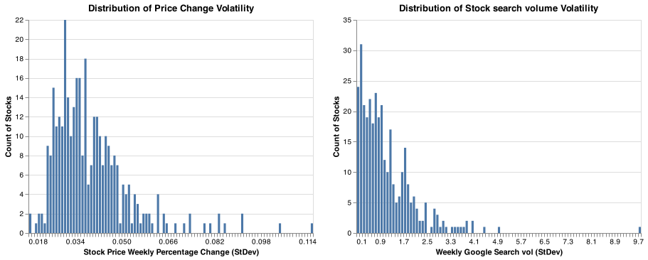
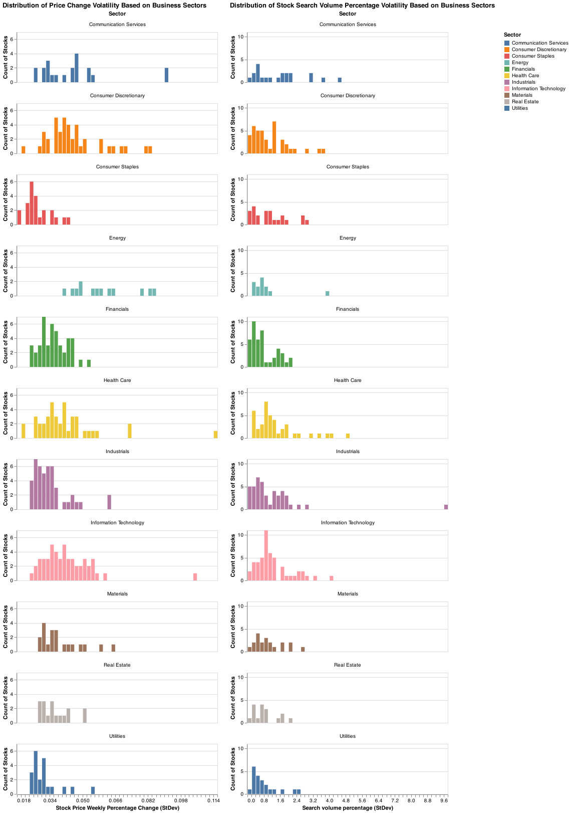
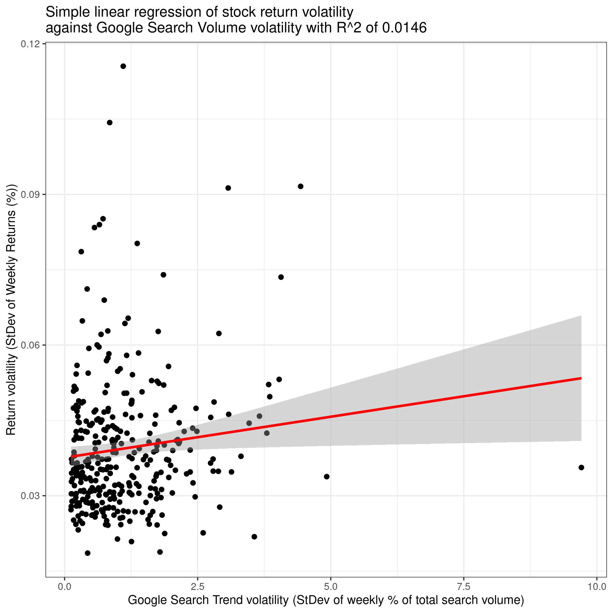
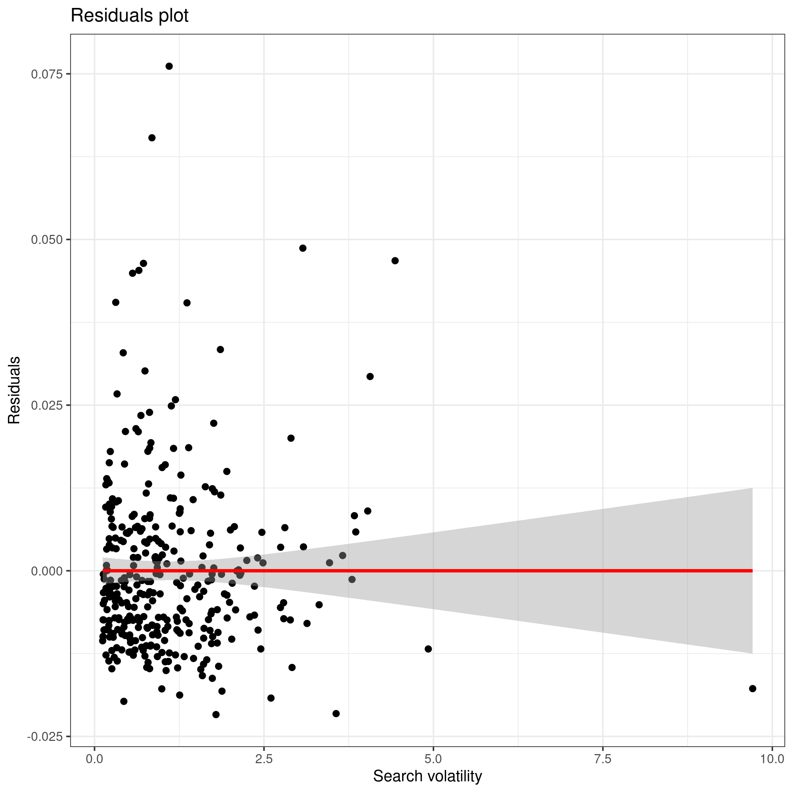
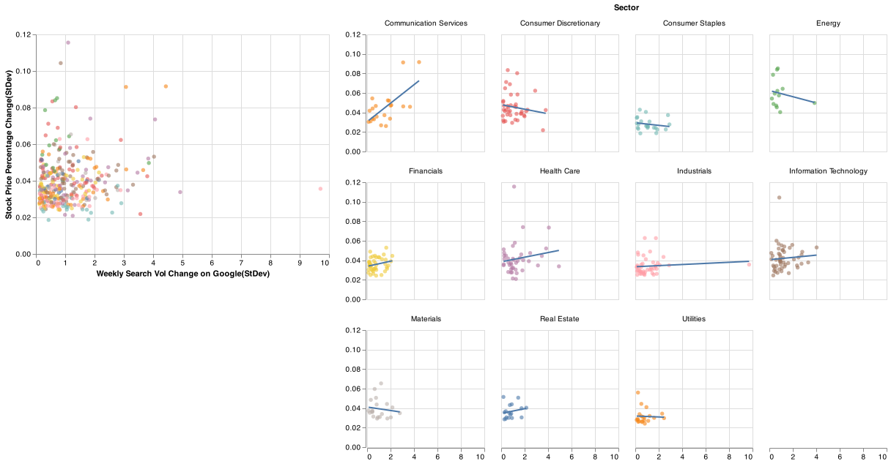

# Summary

In this project, we analyze whether there any association between the
volatility of weekly Google Trends keyword interest of a stock ticker
and the volatility weekly stock returns. We analyze the standard
deviation of weekly search trends and weekly returns over a one-year
period July 2020 to July 2021 of over 300 stocks in the S&P 500,
ultimately finding a small but statistically significant association.

# Introduction

Investment firms are increasingly looking to data science and unusual
data sources to provide informational advantages to bolster their
portfolio strategies. In this project, we are investigating whether
Google Trends data on stock ticker names can provide insight into return
volatility\*\*. Investors are often interested in understanding the
volatility of stock returns. Some financial derivative trading
strategies try to take advantage of changes in a stocks’ return
volatility, as certain options are sensitive to changes in implied
volatility.

To cover the basics, the term “stock market” typically refers to one of
the major stock market indexes, such as the Dow Jones Industrial Average
or the Standard & Poor’s 500, which includes 500 of the largest U.S.
companies. It is a global network in which individuals can purchase
ownership, commonly known as shares, of a public company. Companies will
become public when they are listed under a stock exchange where the
financial instruments are bought and sold. Moreover, a financial
[derivative](https://www.investopedia.com/terms/d/derivative.asp) is a
product or contract which typically derives its value from an underlying
asset, such as an
[option](https://www.investopedia.com/terms/o/option.asp) on a company’s
stock. One property of many option derivatives is option
[vega](https://www.investopedia.com/terms/v/vega.asp), which generally
refers to the sensitivity of the option price to the implied volatility
of the underlying. Some derivative trading strategies revolve around
benefiting from increases or decreases in the implied volatility of the
underlying stock. These properties underscore the motivation for seeking
out associations between unusual data sources and return volatility.

This report was compiled using an R markdown document with scripts
running via `docopt` package\[@docopt\]. The data tables are stored as
.csv files in
[data](https://github.com/UBC-MDS/Stock-Price-Trend-Volatility-Analysis/tree/main/data)
folder. Intermediate analysis is carrying by using
`Pandas`\[@mckinney-proc-scipy-2010\] package in python. The final data
set that we use for analysis is displayed by using `kable` function in
`knitr`\[@knitr\]. The results are showing as .png pictures stored in
[results](https://github.com/UBC-MDS/Stock-Price-Trend-Volatility-Analysis/tree/main/results)
folder and is displayed by applying `knitr` as well.

# Methods

## Data

The data is downloaded from Google Trends, Google Finance and Yahoo
Finance. In the src folder, we provide the automation python files that
we used to extract and ultimately merge these data sources.

We used Pandas-Profiling\[@pandasprofiling2019\] to get a first at the
original data set. There are 5 features and total 17472 observations
with no missing or duplicate values. `weekly_interest` refers to the
interest over time data from Google Trends, which is the number of
search interests of stocks (symbol variable). This number is relative to
the highest point for the given period. A value of 100 is the peak
popularity for the term and a value of 50 means that the term is half as
popular, and a score of 0 means there was not enough data for this term.
In addition, there are 52 consecutive weeks and 336 different stocks
taken into the data set.

Our data cleaning process involved:

-   Converting weekly absolute returns to percent return formats for
    normalization, which corresponds to the percent return one would
    have received that week owning the stock

-   Transforming weekly search index values to a percent of total index
    search values for that stock, which corresponds to a percent of
    yearly search volume per week

We then take the standard deviation of all of the weekly values by
stock, so that our final dataset is one row per stock. The following
table is a sample of 10 rows of data which is ultimately used for our
analysis. The full data set can be found
[here](https://github.com/UBC-MDS/Stock-Price-Trend-Volatility-Analysis/blob/main/data/stocks-prices-trend-volatility.csv).

<table>
<caption>Table 1. The volatility of stock prices and trends(first 10 rows).</caption>
<thead>
<tr class="header">
<th style="text-align: left;">symbol</th>
<th style="text-align: left;">Sector</th>
<th style="text-align: right;">price_change_pct</th>
<th style="text-align: right;">pct_period_search_vol</th>
</tr>
</thead>
<tbody>
<tr class="odd">
<td style="text-align: left;">AAL</td>
<td style="text-align: left;">Industrials</td>
<td style="text-align: right;">0.0628100</td>
<td style="text-align: right;">0.8109703</td>
</tr>
<tr class="even">
<td style="text-align: left;">AAP</td>
<td style="text-align: left;">Consumer Discretionary</td>
<td style="text-align: right;">0.0378506</td>
<td style="text-align: right;">0.5210795</td>
</tr>
<tr class="odd">
<td style="text-align: left;">AAPL</td>
<td style="text-align: left;">Information Technology</td>
<td style="text-align: right;">0.0410338</td>
<td style="text-align: right;">0.8915568</td>
</tr>
<tr class="even">
<td style="text-align: left;">ABBV</td>
<td style="text-align: left;">Health Care</td>
<td style="text-align: right;">0.0307708</td>
<td style="text-align: right;">0.8473470</td>
</tr>
<tr class="odd">
<td style="text-align: left;">ABC</td>
<td style="text-align: left;">Health Care</td>
<td style="text-align: right;">0.0359477</td>
<td style="text-align: right;">0.2220668</td>
</tr>
<tr class="even">
<td style="text-align: left;">ABMD</td>
<td style="text-align: left;">Health Care</td>
<td style="text-align: right;">0.0474028</td>
<td style="text-align: right;">2.4691348</td>
</tr>
<tr class="odd">
<td style="text-align: left;">ABT</td>
<td style="text-align: left;">Health Care</td>
<td style="text-align: right;">0.0275525</td>
<td style="text-align: right;">0.8239577</td>
</tr>
<tr class="even">
<td style="text-align: left;">ACN</td>
<td style="text-align: left;">Information Technology</td>
<td style="text-align: right;">0.0271709</td>
<td style="text-align: right;">0.6953271</td>
</tr>
<tr class="odd">
<td style="text-align: left;">ADBE</td>
<td style="text-align: left;">Information Technology</td>
<td style="text-align: right;">0.0395646</td>
<td style="text-align: right;">0.9256184</td>
</tr>
<tr class="even">
<td style="text-align: left;">ADI</td>
<td style="text-align: left;">Information Technology</td>
<td style="text-align: right;">0.0343544</td>
<td style="text-align: right;">0.6095752</td>
</tr>
</tbody>
</table>

Table 1. The volatility of stock prices and trends(first 10 rows).

## Analysis

In order to assess the inferential question of the association between
stock return volatility and search trend volatility, we analyse the
standard deviation of weekly search trends and weekly returns for over
300 stocks in the S&P 500 over a one-year period from July 2020 to July
2021. We conduct a simple linear regression (SLR) with a confidence
level of 0.95 with the return volatility as the dependent variable and
search trends volatility as the independent variable. Our null
hypothesis is that there is no association between the two volatilities,
with the alternative being that there is an association. Please note
that we are not testing causality between the search and price
volatility, we only focus on the association. We leave causal analysis
for future research. We use *R*2 to assess how much variation
in the data our model is explaining, and use a *p* − *v**a**l**u**e*
compared to a 0.05 significance level to decide on whether we may reject
the null hypothesis.

The following plot show the distributions of price change volatility and
stock search volume volatility for all stocks in the data. We see a
right skewed normal shape for price change volatility and more of an
exponential distribution for search volume volatility.

Figure 1. Volatility distribution

Now we have the distributions by different sectors:

Figure 2. Volatility distribution by sectors

Above we plot histograms of the standard deviations of returns and
trends of around 330 stocks selected from the S&P500. We broadly observe
that within the subsectors, the distribution of volatility is fairly
similar to the overall distributions for both return and search
volatility.

# Results & Discussion

    cat(read_lines("../data/regression-results.txt"), sep = '\n')

    ## 
    ## Regression Results
    ## =================================================
    ##                           Dependent variable:    
    ##                       ---------------------------
    ##                            price_change_pct      
    ## -------------------------------------------------
    ## pct_period_search_vol           0.002**          
    ##                                 (0.001)          
    ##                                                  
    ## Constant                       0.038***          
    ##                                 (0.001)          
    ##                                                  
    ## -------------------------------------------------
    ## Observations                      336            
    ## R2                               0.015           
    ## Adjusted R2                      0.012           
    ## Residual Std. Error        0.013 (df = 334)      
    ## F Statistic              4.932** (df = 1; 334)   
    ## =================================================
    ## Note:                 *p<0.1; **p<0.05; ***p<0.01

Figure 3. Regression

Figure 4. Residuals

Given that our p-value of 0.027 for our slope coefficient is less than
our significance level of 0.05, we find a significant coefficient of
trend volatility and reject the null hypothesis in favour of the
alternative. The *R*2 value of 0.015 indicates that our
simple model is explaining very little of the variation in return
volatility, but more work needs to be done to assess how this compares
to other modelling done in the financial domain. Moreover, the effect
size seems to be fairly small in relation to the range of return
volatility that we observe in the data, but we leave formal analysis of
effect size for future iterations of this project.

Our residual plot demonstrates that our residuals are not seemingly
abnormally distributed. We see broad normal distribution around 0 given
search volatility, and we do not observe any obvious change in variance
or direction of residuals across the plot. This means that it is
unlikely we have meaningfully violated regression assumptions.

Figure 5. Regression result for volatility by sectors

Comparing across sectors, while the histogram distributions of
volatility of searches and returns seemed fairly similar to the overall
distribution, it seems as if the same notion does not hold for the
association between variables. Some sectors, such as communication
services, seem to have a much stronger relationship than utilities,
while some sectors even display a negative relationship. It must be
noted that since we slice up our data considerably to perform this
analysis, we should expect more sampling variation. Thus, we do not
formally analyse our data by sector but leave this for future iterations
of the project where we can hopefully collect more data.

# Limitations & Future Research

Some of our limitations include the fact that we have one year of data
and stocks are selected from one index only. It is unclear whether the
relationship would be robust across different time periods or stock
pools. Moreover, with respect to time, much financial analysis done in
industry is performed in a time series manner. Given our analytical
limitations, we leave a time series analysis of this relationship for
future research.

We have limited features in a simple linear regression. Therefore, a
logical next step may be to expand our features. For example, while we
use searched stock tickers for this EDA, we can perhaps use the company
names or other adjacent searches in a multivariate regression for our
volatility analysis.

It must be noted again that our simple model is explaining very little
of the variation in return volatility. This caveat is to be expected
considering we are using a very simple model to understand markets which
contain lots of complexity.

Ultimately, this positive result is exciting and warrants future
investigation into the use of Google Trends for Financial Analysis.

# References
